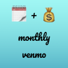

# Monthly Venmo

## Local Development

<!-- PROJECT SHIELDS -->
<!--
*** I'm using markdown "reference style" links for readability.
*** Reference links are enclosed in brackets [ ] instead of parentheses ( ).
*** See the bottom of this document for the declaration of the reference variables
*** for contributors-url, forks-url, etc. This is an optional, concise syntax you may use.
*** https://www.markdownguide.org/basic-syntax/#reference-style-links
-->

[![Contributors][contributors-shield]][contributors-url]
[![Forks][forks-shield]][forks-url]
[![Stargazers][stars-shield]][stars-url]
[![Issues][issues-shield]][issues-url]
[![MIT License][license-shield]][license-url]

<!-- PROJECT LOGO -->
<br />
<p align="center">
  <a href="https://github.com/jsjoeio/monthly-venmo">
    
  </a>

  <h3 align="center">monthly-venmo</h3>

  <p align="center">
    A Python script to automate monthly Venmo requests
    <br />
    <a href="https://github.com/jsjoeio/monthly-venmo"><strong>Explore the docs »</strong></a>
    <br />
    <br />
    <a href="https://github.com/jsjoeio/monthly-venmo">View Demo</a>
    ·
    <a href="https://github.com/jsjoeio/monthly-venmo/issues">Report Bug</a>
    ·
    <a href="https://github.com/jsjoeio/monthly-venmo/issues">Request Feature</a>
  </p>
</p>

<!-- TABLE OF CONTENTS -->
<details open="open">
  <summary><h2 style="display: inline-block">Table of Contents</h2></summary>
  <ol>
    <li>
      <a href="#about-the-project">About The Project</a>
      <ul>
        <li><a href="#built-with">Built With</a></li>
      </ul>
    </li>
    <li>
      <a href="#getting-started">Getting Started</a>
      <ul>
        <li><a href="#prerequisites">Prerequisites</a></li>
        <li><a href="#installation">Installation</a></li>
      </ul>
    </li>
    <li><a href="#license">License</a></li>
    <li><a href="#contact">Contact</a></li>
    <li><a href="#acknowledgements">Acknowledgements</a></li>
  </ol>
</details>

<!-- ABOUT THE PROJECT -->

## About The Project

<div align="center">
  
  
</div>

This is a Python script which runs once a month and sends Venmo requests. And it notifies you via Telegram when the requests were sent.

There is also a second script — `health.py` — which runs once a week on Sundays to ensure everything is working as expected.

### Built With

- [Python](https://www.python.org/downloads/)
- [pip](https://pip.pypa.io/en/stable/installing/)
- [GitHub Actions](https://docs.github.com/en/actions)
- [Venmo](https://venmo.com/signup/)
- [Telegram](https://telegram.org/)

<!-- GETTING STARTED -->

## Getting Started

To get a local copy up and running follow these simple steps.

### Prerequisites

- Python >= v3
- `pip`

### Installation

1. Clone the repo
   ```sh
   git clone https://github.com/jsjoeio/monthly-venmo.git
   ```
2. Install pip packages
   ```sh
   pip install -r requirements.txt
   ```
3. Copy the `.env.example` to `.env` and add environment variables
4. Run the health script to verify setup:
   ```sh
   python3 health.py
   ```
5. Run the main script:
   ```sh
   python3 init.py
   ```

### Updating the `requirements.txt`

1. Run this command

```shell
pip3 freeze > requirements.txt
```

2. delete all the nonesense (aka leave only the actual modules used in the script)

<!-- LICENSE -->

## License

Distributed under the GPL-3.0 License. See [`LICENSE`](./LICENSE) for more information.

<!-- CONTACT -->

## Contact

Joe Previte - [@jsjoeio](https://twitter.com/jsjoeio)

Project Link: [https://github.com/jsjoeio/monthly-venmo](https://github.com/jsjoeio/monthly-venmo)

<!-- ACKNOWLEDGEMENTS -->

## Acknowledgements

- [@mmohades for the Venmo library](https://github.com/mmohades/Venmo)
- [@liiight for the notifiers library](https://github.com/liiight/notifiers)
- [@othneildrew for the README template](https://github.com/othneildrew/Best-README-Template)

<!-- MARKDOWN LINKS & IMAGES -->
<!-- https://www.markdownguide.org/basic-syntax/#reference-style-links -->

[contributors-shield]: https://img.shields.io/github/contributors/jsjoeio/monthly-venmo.svg?style=for-the-badge
[contributors-url]: https://github.com/jsjoeio/monthly-venmo/graphs/contributors
[forks-shield]: https://img.shields.io/github/forks/jsjoeio/monthly-venmo.svg?style=for-the-badge
[forks-url]: https://github.com/jsjoeio/monthly-venmo/network/members
[stars-shield]: https://img.shields.io/github/stars/jsjoeio/monthly-venmo.svg?style=for-the-badge
[stars-url]: https://github.com/jsjoeio/monthly-venmo/stargazers
[issues-shield]: https://img.shields.io/github/issues/jsjoeio/monthly-venmo.svg?style=for-the-badge
[issues-url]: https://github.com/jsjoeio/monthly-venmo/issues
[license-shield]: https://img.shields.io/github/license/jsjoeio/monthly-venmo.svg?style=for-the-badge
[license-url]: https://github.com/jsjoeio/monthly-venmo/blob/master/LICENSE.txt
